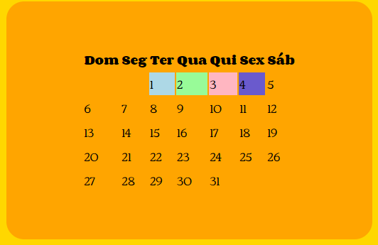
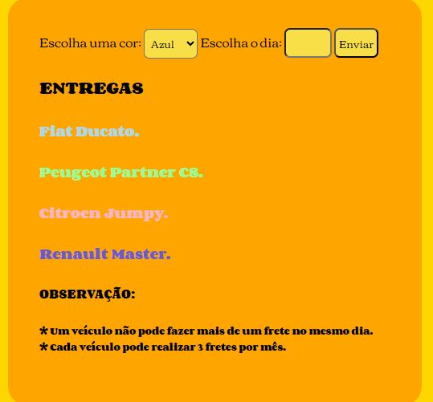

<<<<<<< HEAD
# Projeto Website de produtos

## 🚀 Começando
 
Nesse projeto, foi criado um Calendário-web na matéria de:
 * Programação Web I.

## 📋 Sobre o projeto

 Nessa atividade, teriámos que achar uma solução para o calendário que estava atrasando os dias e após isso, estilizar o mesmo utilizando o css. Para melhor compreensão das pessoas (ou pelo menos tentei), coloquei os nomes dos carros com a mesma cor dos seus respectivos dias no calendário.
 
 

## Como podemos utilizar esse projeto?

 Esse projeto serve para alguma empresa que trabalhe com fretes souber quais carros e em quais dias eles terão que fazer essas entregas. Porém existem algumas regrinhas nesse trabalho, como:
 * Existem 4 veículos para as realizações dos fretes.
 * Cada veículo tem a sua própria cor de identificação.
 * Um veículo não pode fazer mais de um frete no mesmo dia.
 * Cada veículo pode realizar somente 3 fretes por mês.

## Técnicas e tecnologias utilizadas

* Visual Studio Code.
* Git Bash.
* Git Hub
* HTML5
* CSS3
* JavaScript
* Live Server (A extensão Live Server permite criar um servidor local através do VSCode. Com ele, é cortado a necessidade de sempre que fizer uma alteração no código atualizar o navegador.)

## ✍🏻Autores
| [ Larissa Gabrielle Fagundes Andrade.](https://github.com/gabriellefagundes) |
=======
# Calendário-Web.
## 🚀 Começando
Nesse projeto, foi criado um calendário virtual na matéria de:
* Programação Web I.

## 📋 Sobre o projeto
 
## 🔨Técnicas e Tecnologias utilizadas
* Visual Studio Code 
* JavaScript
* Git Bash
* Git Hub
* HTML5
* CSS3
* Live Server (A extensão Live Server permite criar um servidor local através do VSCode. Com ele é cortado a necessidade de sempre que fizer uma alteração no código atualizar o navegador.)

## ✍🏻Autores
|  Larissa Gabrielle Fagundes Andrade. 
>>>>>>> 4bcfce64b5d7db05d7f8d89bd430a8fa63588192
| :---: 